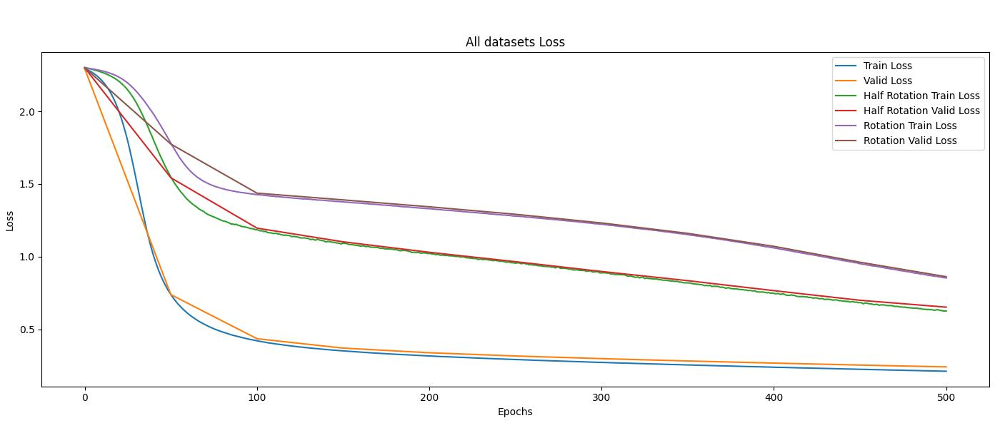
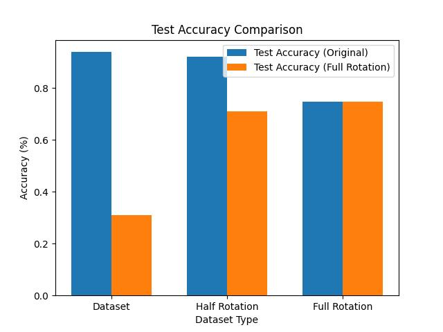
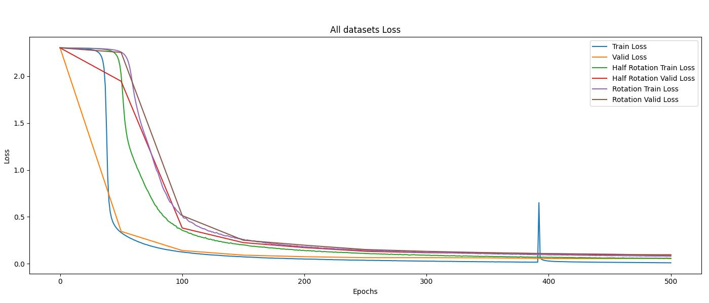
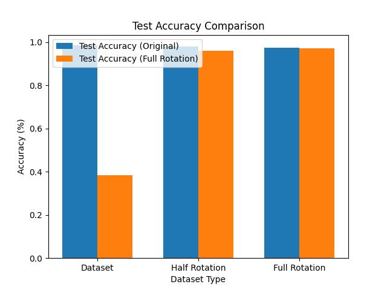

# Linear vs. Convolution

This experiment aims to demonstrate that convolutional layers are more effective than linear layers for image learning, as they capture image features rather than just positional information.

## Environment

### Software
- **Host OS**: Windows 11
- **CUDA**: 12.4

### Hardware
- **CPU**: AMD Ryzen 5 7500F 6-Core Processor
- **GPU**: RTX 4070 Ti Super
- **RAM**: 32GB

## Experiment Environment
- **Docker**: Ubuntu 22.04
- **Python**: 3.10.12
- **Libraries**: See `requirements.txt`

## Dataset
We used the **MNIST Dataset**, which consists of:
- **Total images**: 70,000 (60,000 for training, 10,000 for testing)
- **Number of classes**: 10 (digits 0-9)
- **Image size**: 28×28 pixels (grayscale)
- **Training Data Split**: 80% (train) / 20% (validation)
- **Augmentations**:
  - **Original**: No augmentation.
  - **Half Rotation**: 50% of the dataset remains unchanged, while the other 50% undergoes random **360° rotation**.
  - **Full Rotation**: 100% of the dataset undergoes random **360° rotation**.
- **Test Data**:
  - The full test dataset (10,000 images) was used without augmentation.
  - Test images were either in the **Original** or **Full Rotation** format.

## Experiment Settings
- **Optimizer**: SGD
- **Loss Function**: Cross-Entropy Loss (CELoss)
- **Model Parameters**:
  - Both **Linear** and **Convolutional** models have approximately **210,000 parameters**.
- **Hyperparameters**: See `conf/config.yaml` for details.

## Experiment Results

### Linear Model



#### 1. Linear Training (Original)
- **Original Test Accuracy**: 90%
- **Full Rotation Test Accuracy**: 30%
  - Most classes have an accuracy below 30%, except for a few.
- **Conclusion**:
  - The model performs poorly on rotated images, likely due to a lack of rotation-awareness in training.

#### 2. Linear Training (Half Rotation, Full Rotation)
- **Original Test Accuracy**: 92% (Half Rotation) | 74% (Full Rotation)
  - The model trained on Half Rotation data achieves 18% higher accuracy than the one trained on Full Rotation.
- **Full Rotation Test Accuracy**: 71% (Half Rotation) | 74% (Full Rotation)
  - The model trained on Full Rotation data performs slightly better than the Half Rotation model by 3%.
- **Conclusion**:
  - Training on Half Rotation data significantly improves the model's generalization without degrading its performance on the original dataset.
  - Full Rotation accuracy increased from **30% to 70%**, but this is still relatively low.
  - Since linear models process images pixel by pixel, they are inherently sensitive to positional changes.
  - What if we use CNNs, which learn both position-independent features and spatial structures?

---

### Convolutional Model



#### 3. CNN Training (Original)
- **Original Test Accuracy**: 98%
- **Full Rotation Test Accuracy**: 38%
  - Most classes have an accuracy below 30%, except for a few.
- **Conclusion**:
  - Compared to linear models, CNNs show an 8% increase in accuracy for both test cases.
  - However, accuracy on rotated images is still relatively low.
  - The poor performance might be due to a lack of rotation-aware training.

#### 4. CNN Training (Half Rotation, Full Rotation)
- **Original Test Accuracy**: 98% (Half Rotation) | 97% (Full Rotation)
  - The model trained on Half Rotation data performs slightly better than the Full Rotation model.
- **Full Rotation Test Accuracy**: 96% (Half Rotation) | 97% (Full Rotation)
  - The Full Rotation-trained model achieves marginally higher accuracy.
- **Conclusion**:
  - Compared to linear models, CNNs show a **6% improvement on the Original test** and a **22% improvement on the Full Rotation test**.
  - This confirms that CNNs, which learn spatial features rather than just positional information, are more effective for image classification.

## Key Findings & Takeaways
- **Linear models** struggle with positional variations and rotations.
- **CNNs** significantly improve feature extraction and generalization to rotated images.
- Training with **Half Rotation** provides a balance between maintaining original accuracy and improving generalization.
- **Full Rotation training** boosts robustness to extreme rotations but slightly lowers performance on the original dataset.

## How to Run the Experiment

1. Clone the repository:
   ```sh
   git clone https://github.com/your-repo-name.git
   cd your-repo-name
   ```
2. Install dependencies:
   ```sh
   pip install -r requirements.txt
   ```
3. Run the training script:
   - For **Linear Model**, set `flatten: True` and `linear: True` in `conf/config.yaml`:
     ```yaml
     data:
       flatten: True
     model:
       linear: True
     ```
     Then, run:
     ```sh
     python train.py
     ```
   - For **Convolutional Model**, set `flatten: False` and `linear: False` in `conf/config.yaml`:
     ```yaml
     data:
       flatten: False
     model:
       linear: False
     ```
     Then, run:
     ```sh
     python train.py
     ```
4. View results:
   - check **/outputs** folder (It is automatically generated when script is executed.)